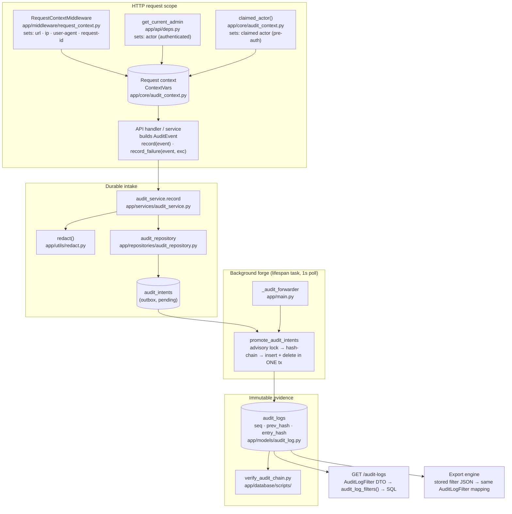
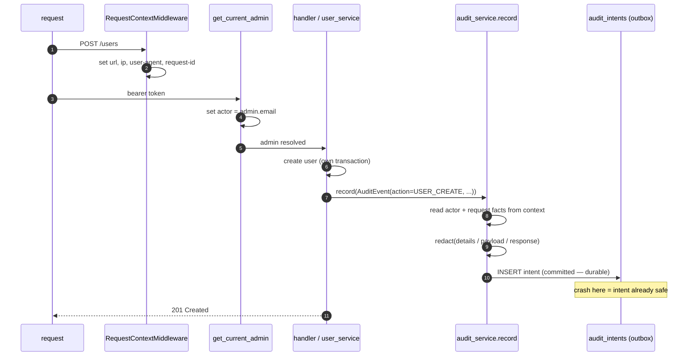
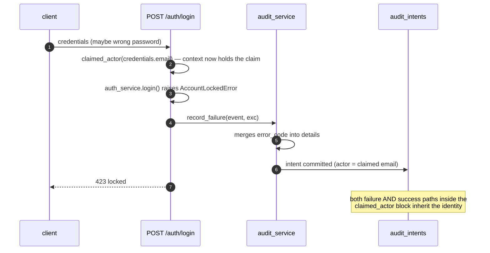
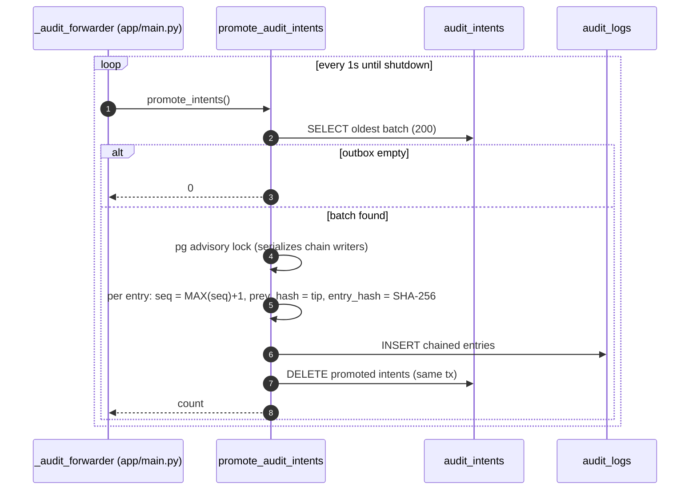
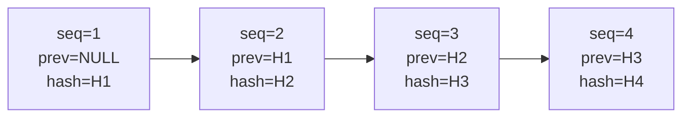
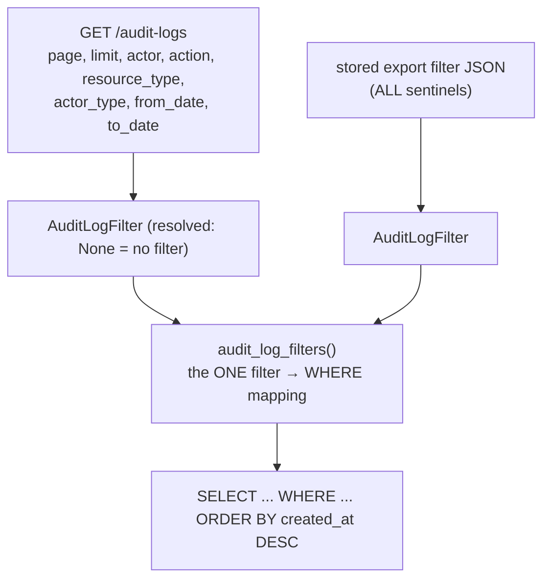

# Audit Logging — Architecture & Flow

How every consequential action in Platform Admin becomes durable, tamper-evident
audit evidence. Grounded in the current implementation; every box names the real
module. View on GitHub (or any Mermaid renderer) for the diagrams to draw.

## The four guarantees

| Guarantee | Mechanism |
| --- | --- |
| Complete — every consequential action is recorded | one `AuditEvent` shape, 1 call per action |
| Attributed — actor always known | identity lives in the request context, never in call sites |
| Durable — evidence survives crashes | Pending Audit Intent written in the request transaction scope, forged asynchronously |
| Tamper-evident — edits/deletes/reorders are detectable | SHA-256 hash chain over `seq`-ordered entries |

---

## 1. Component map



**One source of truth per concern**

| Concern | Lives in | Set by |
| --- | --- | --- |
| What happened (action, resource, payload, reason) | the `AuditEvent` | each call site |
| Who did it (actor, actor_type) | request context | `get_current_admin` · `claimed_actor` · `system_actor` |
| Where from (url, ip, ua, request-id) | request context | `RequestContextMiddleware`, once |

---

## 2. Write flow — authenticated action (happy path)

Example: an admin creates a user.



The intent insert is best-effort: if the database rejects it, the action still
succeeds and the failure is logged — evidence quality is degraded, never faked.

## 3. Pre-auth flow — login / OTP / password reset

Nobody is authenticated yet, so the endpoint **claims** an identity: the email
from the submitted credentials. A failed login by an attacker records the
attacker's email — that is the evidence.



`POST /auth/refresh` is the one flow with no claimable identity (the body is
just a token) — its entries honestly record `actor = NULL`.

## 4. The forge — outbox promotion loop

A lifespan task polls every second. Promotion is atomic: **insert entries +
delete intents in one transaction**, so a crash retries the batch and can never
duplicate or lose evidence.



Evidence timestamps never move: the entry's `created_at` is the action time
copied from the intent, not the promotion time.

## 5. The hash chain — tamper evidence

Each entry seals its own fields *and* its position, linking to the previous
entry's seal.



```
entry_hash = SHA-256( prev_hash | canonical_json(seq, actor, action, ..., created_at) )
```

`verify_audit_chain.py` walks entries in `seq` order and recomputes every hash.
Exit code 1 + a `TAMPER:` line on the first break.

| Attack | Detection |
| --- | --- |
| Edit a field in any row | its `entry_hash` no longer matches |
| Delete a middle row | next row's `prev_hash` doesn't link |
| Reorder rows | `seq` inside the hash no longer matches position |
| Fabricate a new row | must also forge every later hash — verifier still catches it because `seq` order and links break |

Not claimed: a DB superuser rewriting the *entire* chain consistently. Detecting
that needs an off-site seal (e.g. exporting the latest `entry_hash` somewhere
external) — the natural job for a future second adapter on this same seam.

## 6. Read & export paths



Adding a filter = one DTO field + one condition in `audit_log_filters()` + one
`Query()` param. No other layer learns about it.

## 7. Failure modes — what evidence survives

| Crash / failure point | Result |
| --- | --- |
| Business change committed, process dies before `record()` | sub-millisecond window; action un-audited (the strict intent-*before*-change pattern for governed modules closes this) |
| `record()` fails (DB blip) | logged, action succeeds — best-effort by design |
| Intent committed, forwarder down | intent waits in the outbox; promoted when the app restarts |
| Forwarder crashes mid-batch | transaction rolls back; retried next pass — no duplicates, no loss |
| DB edited directly | `verify_audit_chain.py` flags it |

## 8. Cheat sheet — where to change what

| Task | Touch |
| --- | --- |
| Audit a new action | add `AuditAction` + `AuditResourceType` enum values (app/models/enums.py), call `record(AuditEvent(...))` after the change |
| Add a sensitive key to mask | `_SENSITIVE_KEYS` in app/utils/redact.py |
| Add a list filter | `AuditLogFilter` (app/schemas/audit.py) + `audit_log_filters()` (audit_repository) + the `Query()` param |
| Check evidence integrity | `uv run python app/database/scripts/verify_audit_chain.py` |
| Add a governed module needing intent-*before*-change | claim the intent before the write, close it with the outcome — same outbox, same forge |
